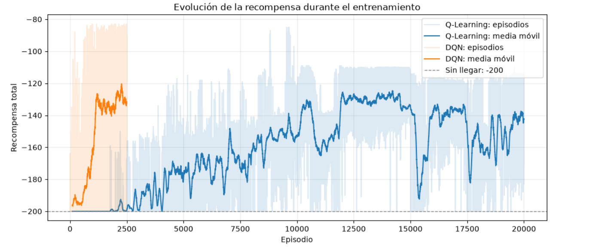
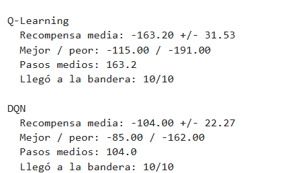
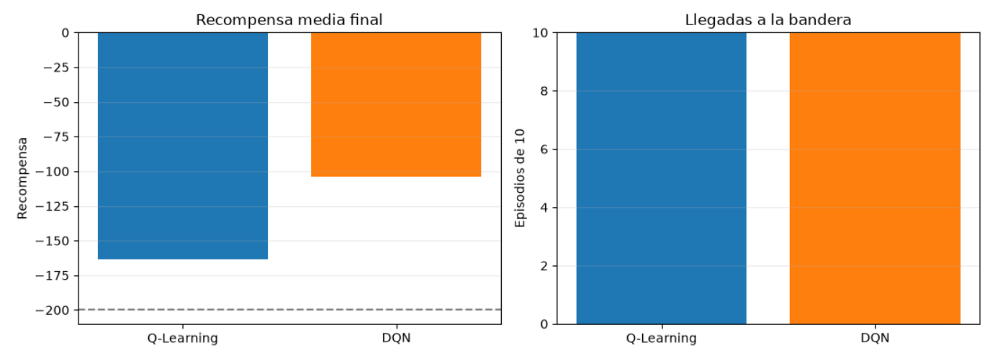

# Comparación de agentes en MountainCar-v0: Q-Learning vs DQN

La idea central fue entrenar dos agentes para resolver el mismo problema y comparar cómo se
comportan: uno que aprende con una **tabla** (Q-Learning) y otro que aprende
con una **red neuronal** (DQN). Durante el entrenamiento se obtuvieron los resultados mostrados a continuación.

## 1. El problema

En MountainCar-v0 hay un automóvil en un valle entre dos montañas. El objetivo
es llegar a una bandera que está en la cima de la derecha. El detalle es que el
motor no tiene fuerza suficiente para subir directamente: el automóvil tiene que
moverse hacia un lado, tomar impulso y usarlo para subir.

- **Estado:** posición y velocidad del automóvil (dos números continuos).
- **Acciones:** empujar a la izquierda, no empujar, empujar a la derecha.
- **Recompensa:** `-1` por cada paso. El episodio termina al llegar a la bandera
  o a los 200 pasos.

Como cada paso cuesta `-1`, una recompensa menos negativa significa que el
agente llegó más rápido. Por ejemplo, `-110` es mejor que `-180`, y `-200`
significa que nunca llegó.

## 2. Qué hice

1. **Q-Learning tabular.** Como la tabla necesita estados discretos, dividí la
   posición y la velocidad en rangos (según el enunciado, `n_bins=20`, es decir
   400 celdas posibles). Cada celda guarda un valor por acción. El agente elige
   con epsilon-greedy y actualiza la tabla con la regla de Q-Learning. Lo entrené
   durante **20 000 episodios**.
2. **DQN.** Reemplacé la tabla por una red neuronal que recibe el estado y
   devuelve un valor por acción. Usa una memoria de experiencias, una red
   principal y una red objetivo. Lo entrené durante **2 500 episodios**.
3. **Exploración por bloques en DQN.** Con epsilon-greedy normal, DQN se quedaba
   plano en `-200`: los empujes aleatorios de un paso se cancelan entre sí y el
   automóvil nunca llega a la bandera, así que la red no tiene nada de qué
   aprender. Lo que funcionó fue mantener una misma acción durante varios pasos,
   para que se produzca el balanceo que necesita el problema.
4. **Notebook de comparación.** Entrena ambos agentes desde cero, guarda la
   recompensa de cada episodio, grafica la evolución con una media móvil y evalúa
   cada agente en 10 episodios nuevos.

## 3. Resultados

Todas las cifras de esta sección salen de `notebooks/comparacion_agentes.ipynb`.

### 3.1 Evolución durante el entrenamiento



Lo que veo en la gráfica (los valores son aproximados, leídos de la curva):

- **DQN** se queda cerca de `-200` durante los primeros cientos de episodios. Hacia
  el episodio 1 000 sube rápido y se estabiliza alrededor de `-130`, con un
  máximo cercano a `-120` cerca del episodio 2 250.
- **Q-Learning** se queda en `-200` durante unos 2 500 episodios. Después mejora
  despacio y con muchos altibajos hasta llegar a `-125` o `-135` entre los
  episodios 12 000 y 15 000.
- Alrededor del episodio 15 000 Q-Learning empeora bastante (baja hasta cerca de
  `-190`), se recupera y luego tiene otras caídas menores. Termina el
  entrenamiento cerca de `-140`.

### 3.2 Evaluación final (10 episodios nuevos)

| Agente | Episodios de entrenamiento | Recompensa media | Desv. | Mejor | Peor | Pasos medios | Llegó a la bandera |
|---|---:|---:|---:|---:|---:|---:|---:|
| Q-Learning | 20 000 | `-163.20` | 31.53 | `-115` | `-191` | 163.2 | 10/10 |
| DQN | 2 500 | `-104.00` | 22.27 | `-85` | `-162` | 104.0 | 10/10 |





**Mejor resultado de cada agente:**

- **DQN:** su mejor episodio de evaluación fue de `-85` (85 pasos), y su media
  fue `-104.00`.
- **Q-Learning:** su mejor episodio de evaluación fue de `-115`, y su media fue
  `-163.20`.

Los dos agentes llegaron a la bandera en los 10 episodios, así que ambos
aprendieron a resolver el problema. La diferencia está en qué tan rápido lo
hacen: DQN llega en promedio 59 pasos antes.

## 4. Comparación

| Aspecto | Q-Learning | DQN |
|---|---|---|
| Idea | Tabla de valores | Red neuronal de valores |
| Estabilidad | Curva con muchos altibajos y una caída fuerte cerca del episodio 15 000 | Curva más suave en los 2 500 episodios, con un techo alrededor de `-120` a `-130` |
| Velocidad de aprendizaje | Lenta: unos 2 500 episodios en `-200` y cerca de 12 000 para acercarse a `-125` | Rápida: mejora hacia el episodio 1 000 |
| Desempeño final | `-163.20` de media, mejor `-115` | `-104.00` de media, mejor `-85` |
| Facilidad de implementación | Alta | Media |
| Memoria y cómputo | Bajo | Mayor (red, memoria de experiencias, red objetivo) |
| Fortaleza | Fácil de entender y de revisar | Maneja estados continuos sin discretizar |
| Limitación | Depende de cómo se discretice y la tabla crece con el espacio | Necesita más ajustes y puede no aprender si nunca llega a la bandera |

### Estabilidad del entrenamiento

Antes de correr el experimento esperaba que Q-Learning fuera el más estable,
porque cada estado tiene su propia entrada en la tabla. En mi ejecución no fue
así: su curva oscila bastante y tuvo una caída grande alrededor del episodio
15 000. Mi hipótesis, que no comprobé, es que al agrupar posiciones y
velocidades distintas en la misma celda, una actualización puede afectar a
situaciones que en realidad son diferentes. DQN se vio más estable, aunque solo
lo entrené 2 500 episodios y no sé cómo se habría comportado en un
entrenamiento más largo.

### Velocidad de aprendizaje

Contando episodios, DQN aprendió mucho más rápido: en unos 1 000 a 1 200
episodios ya rondaba `-130`, mientras que Q-Learning necesitó miles de episodios
solo para salir de `-200`. No medí el tiempo real de ejecución, así que no puedo
decir cuál fue más rápido en segundos. Cada actualización de DQN cuesta más
cómputo que la de la tabla.

### Desempeño final

DQN fue mejor en la evaluación (`-104.00` contra `-163.20`), y su peor episodio
(`-162`) fue mejor que la media de Q-Learning. Algo que me llamó la atención:
la evaluación de Q-Learning (`-163.20`) quedó peor que el final de su curva de
entrenamiento (cerca de `-140`) y peor que la referencia que traía el enunciado
(cerca de `-133`). Creo que se debe a dos cosas: la tabla que evalué es la del
final del entrenamiento, que coincidió con un momento bajo de una curva muy
oscilante, y son solo 10 episodios de evaluación. Es una explicación probable,
pero no la verifiqué.

### Dificultad de implementación

Q-Learning fue más sencillo: discretizar, elegir la acción y actualizar la
tabla. DQN exige más piezas (red, memoria, red objetivo, pasos de gradiente) y
más cuidado con detalles como las formas de los tensores o el uso de
`terminated` (y no `truncated`) como marca de final. Además, DQN necesitó la
exploración por bloques para aprender en este problema.

## 5. Conclusión

Para MountainCar, DQN me dio mejores resultados: aprendió con muchos menos
episodios y terminó con una recompensa media de `-104.00` frente a `-163.20` de
Q-Learning. Q-Learning es más fácil de programar y de entender, pero en mi
ejecución fue más lento y más irregular. Los dos resolvieron el problema
(10/10 llegadas).

## 6. Limitaciones de mi comparación

- Hice **una sola ejecución** por agente, y los resultados pueden cambiar con otra
  semilla.
- La evaluación usa solo **10 episodios**, por lo que las medias son ruidosas.
- Entrené con **distinto número de episodios** (20 000 y 2 500). Comparé en
  episodios, no en tiempo.
- Para una comparación más sólida haría varias ejecuciones con distintas
  semillas, evaluaría con más episodios y guardaría el mejor punto del
  entrenamiento en lugar del último.

## 7. Esquemas del proceso

Los esquemas del entrenamiento de cada agente están en
[`docs/diagramas_entrenamiento.md`](docs/diagramas_entrenamiento.md):

- Q-Learning: `docs/esquemas/esquema_qlearning.png`
- DQN: `docs/esquemas/esquema_dqn.png`

## 8. Instalación y ejecución

Desde la carpeta del proyecto:

```powershell
uv sync
```

Revisar el entorno:

```powershell
uv run mountaincar inspect --steps 3
```

Entrenar y evaluar cada agente:

```powershell
uv run mountaincar train qlearning --episodes 20000
uv run mountaincar load qlearning --eval
```

```powershell
uv run mountaincar train dqn --episodes 2500
uv run mountaincar load dqn --eval
```

Ver al agente:

```powershell
uv run mountaincar sim dqn --episodes 1 --steps 30
uv run mountaincar render dqn --episodes 3
```

Abrir el notebook de comparación:

```powershell
uv run jupyter notebook notebooks/comparacion_agentes.ipynb
```

También se puede abrir desde VS Code con el kernel del entorno creado por `uv`.

## 9. Estructura

```text
src/mountain_car/agents/qlearning.py   # Agente con tabla
src/mountain_car/agents/dqn.py         # Agente con red neuronal
notebooks/comparacion_agentes.ipynb    # Gráficas y comparación
docs/diagramas_entrenamiento.md        # Esquemas del entrenamiento
docs/esquemas/                         # Dibujos de Q-Learning y DQN
docs/evidencia/                        # Capturas de resultados del notebook
EXERCISES.md                           # Enunciado de los ejercicios
saves/                                 # Archivos generados al entrenar
```
