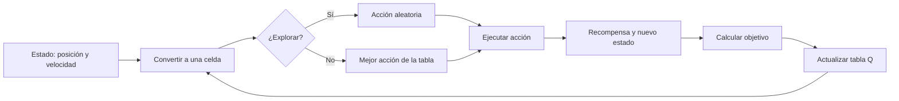
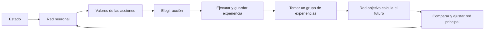

# Comparación de agentes en MountainCar-v0

Este repositorio es una práctica de aprendizaje por refuerzo. El objetivo es
que un automóvil salga de un valle y llegue a una bandera usando la menor
cantidad posible de pasos.

El automóvil no tiene fuerza suficiente para subir directamente. Primero debe
moverse hacia un lado, ganar impulso y usarlo para subir la montaña. Por eso se
comparan dos formas de aprender:

- **Q-Learning:** guarda los valores de las acciones en una tabla.
- **DQN:** aprende esos valores con una red neuronal.

## Resultado esperado

Cada paso recibe una recompensa de `-1`. Si el agente no llega a la bandera en
200 pasos, obtiene `-200`. Por tanto, una recompensa de `-110` es mejor que una
de `-180`.

El notebook genera las gráficas y las cifras reales de la ejecución:

```text
notebooks/comparacion_agentes.ipynb
```

Como referencia del ejercicio:

| Agente | Recompensa aproximada | Llegada esperada | Interpretación |
|---|---:|---:|---|
| Q-Learning | `-133` | 100/100 | Aprende, pero necesita más episodios. |
| DQN | `-106` | 100/100 | Puede obtener un resultado mejor, con más ajustes. |

Estas cifras son referencias, no resultados inventados para esta documentación.
La evidencia válida para el informe es la salida y las gráficas del notebook.

## Instalación y ejecución

Desde la carpeta del proyecto:

```powershell
uv sync
```

Revisar el entorno:

```powershell
uv run mountaincar inspect --steps 3
```

Entrenar y evaluar cada agente:

```powershell
uv run mountaincar train qlearning --episodes 20000
uv run mountaincar load qlearning --eval
```

```powershell
uv run mountaincar train dqn --episodes 2500
uv run mountaincar load dqn --eval
```

Ver al agente:

```powershell
uv run mountaincar sim dqn --episodes 1 --steps 30
uv run mountaincar render dqn --episodes 3
```

## Notebook de comparación

El notebook:

1. Define una semilla y el número de episodios.
2. Entrena Q-Learning y DQN desde cero.
3. Guarda la recompensa de cada episodio.
4. Grafica la evolución y una media móvil.
5. Evalúa cada agente en 10 episodios nuevos.
6. Muestra recompensa media, variación, mejor y peor episodio, pasos medios y
   cantidad de llegadas a la bandera.

Para abrirlo:

```powershell
uv run jupyter notebook notebooks/comparacion_agentes.ipynb
```

También se puede abrir directamente desde VS Code usando el kernel del entorno
creado por `uv`.

## Comparación sencilla

### Estabilidad

Q-Learning suele ser más fácil de seguir porque cada estado tiene una entrada
concreta en la tabla. Si la discretización es razonable, sus cambios son más
claros.

DQN puede variar más: la red ajusta muchos valores al mismo tiempo y depende de
la memoria de experiencias, el tamaño del grupo de entrenamiento y la red
objetivo.

### Velocidad de aprendizaje

Q-Learning tarda más episodios, pero cada actualización es sencilla. DQN puede
mejorar más después de descubrir una buena experiencia, aunque al comienzo
puede no aprender si nunca llega a la bandera.

### Desempeño final

En este entorno, DQN puede acercarse a `-106`, mientras Q-Learning suele quedar
cerca de `-133`. La comparación final debe tomarse de la tabla y las gráficas
producidas por el notebook, porque cada ejecución puede variar.

### Ventajas, limitaciones y dificultad

| Aspecto | Q-Learning | DQN |
|---|---|---|
| Idea | Tabla de valores | Red neuronal de valores |
| Facilidad | Alta | Media |
| Memoria | Baja | Mayor, por la red y las experiencias |
| Fortaleza | Claro en espacios pequeños | Maneja estados continuos sin una tabla enorme |
| Limitación | La tabla crece con el espacio | Puede ser inestable y requiere más ajustes |
| Implementación | Discretizar, elegir y actualizar | Red, memoria, red objetivo y gradientes |

Q-Learning necesita convertir la posición y velocidad en una celda, escoger una
acción y actualizar su valor. DQN necesita además una red principal, una red
objetivo, una memoria de experiencias y grupos de entrenamiento. En este
proyecto también se usa una exploración por bloques: el agente mantiene un
empuje durante varios pasos para producir el balanceo que MountainCar necesita.

## Esquemas del proceso

Los dibujos están escritos manualmente en Mermaid para que se puedan leer y
editar; no son imágenes generadas por IA. La fuente completa está en
[`docs/diagramas_entrenamiento.md`](docs/diagramas_entrenamiento.md).

### Q-Learning



### DQN



## Estructura

```text
src/mountain_car/agents/qlearning.py   # Agente con tabla
src/mountain_car/agents/dqn.py         # Agente con red neuronal
notebooks/comparacion_agentes.ipynb    # Gráficas y comparación
docs/diagramas_entrenamiento.md        # Fuentes editables de los esquemas
EXERCISES.md                           # Enunciado de los ejercicios
saves/                                  # Archivos generados al entrenar
```
