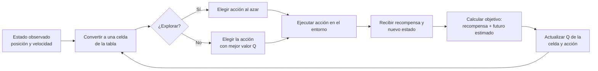
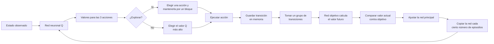

# Esquemas del entrenamiento

> **Propósito:** explicar de forma sencilla el recorrido de una observación
> hasta la actualización del agente.
>
> **Alcance:** implementación de `mountain_car`, sin incluir detalles internos
> de Gymnasium o PyTorch.
>
> **Fuente:** `src/mountain_car/agents/qlearning.py` y
> `src/mountain_car/agents/dqn.py`.
>
> **Fecha:** 2026-09-20. Los resultados numéricos se generan en
> `notebooks/comparacion_agentes.ipynb`.

## Q-Learning tabular

## DQN

### Leyenda

- `Estado`: posición y velocidad actuales del automóvil.
- `Recompensa`: `-1` por cada paso; menos negativo significa que llegó antes.
- `Red principal`: aprende con las experiencias.
- `Red objetivo`: sirve como referencia más estable para calcular el futuro.
