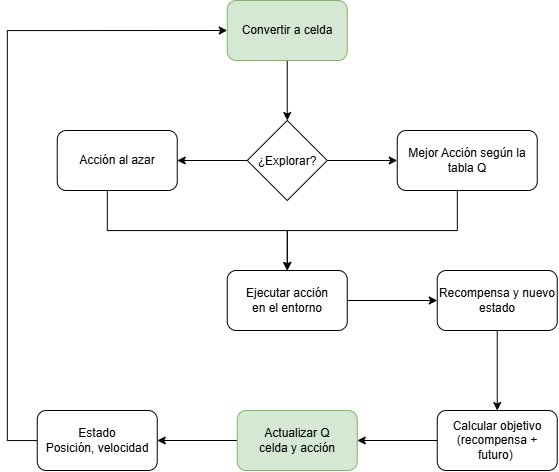
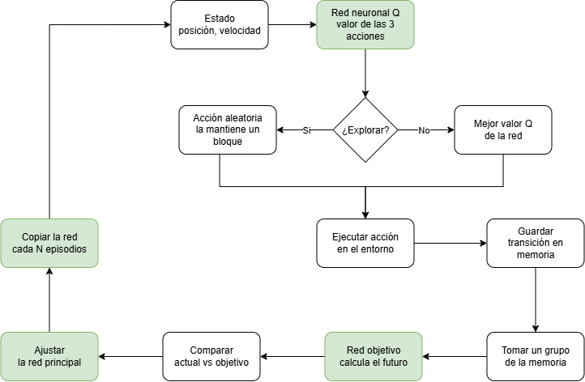

# Esquemas del entrenamiento

> **Propósito:** explicar de forma sencilla el recorrido de una observación
> hasta la actualización del agente.
>
> **Alcance:** implementación de `mountain_car`, sin incluir detalles internos
> de Gymnasium o PyTorch.
>
> **Fuente:** `src/mountain_car/agents/qlearning.py` y
> `src/mountain_car/agents/dqn.py`.
>
> **Resultados numéricos:** se generan en `notebooks/comparacion_agentes.ipynb`.

<!-- COMPLETAR ANTES DE ENTREGAR: indicar cómo se hicieron los dibujos
     (por ejemplo: "dibujados a mano y escaneados" o "hechos por mí en draw.io").
     Los dibujos deben ser de mi autoría, no generados por IA. -->
**Autoría de los dibujos:** *(completar: a mano / en qué herramienta)*.

## Q-Learning tabular

### Recorrido paso a paso

1. **Estado observado:** el automóvil informa su posición y su velocidad.
2. **Convertir a una celda:** como la tabla necesita estados discretos, los dos
   números se agrupan en rangos y se obtiene una celda.
3. **¿Explorar?** Con cierta probabilidad (epsilon) el agente prueba algo al
   azar; si no, usa lo que ya sabe.
4. **Elegir la acción:** al azar si explora, o la de mayor valor Q en esa celda.
5. **Ejecutar la acción** en el entorno.
6. **Recibir recompensa y nuevo estado** (`-1` por paso).
7. **Calcular el objetivo:** la recompensa más una estimación del valor futuro
   (la mejor acción de la celda siguiente).
8. **Actualizar la tabla:** el valor de la celda y la acción usada se acerca al
   objetivo. Luego se repite desde el nuevo estado.

## DQN

### Recorrido paso a paso

1. **Estado observado:** posición y velocidad, sin discretizar.
2. **Red neuronal Q:** recibe el estado y devuelve un valor para cada una de las
   3 acciones.
3. **¿Explorar?** Si explora, elige una acción y **la mantiene durante un
   bloque de pasos**. Esto es necesario en MountainCar para producir el
   balanceo. Si no explora, elige la acción con mayor valor Q.
4. **Ejecutar la acción** en el entorno.
5. **Guardar la transición** (estado, acción, recompensa, nuevo estado, si
   terminó) en la memoria de experiencias.
6. **Tomar un grupo de transiciones** de la memoria.
7. **Red objetivo:** calcula el valor futuro de cada transición.
8. **Comparar** el valor que predice la red principal con ese objetivo.
9. **Ajustar la red principal** para reducir la diferencia.
10. **Copiar la red principal a la red objetivo** cada cierto número de
    episodios, y volver al primer paso.

## Leyenda

- `Estado`: posición y velocidad actuales del automóvil.
- `Recompensa`: `-1` por cada paso; menos negativo significa que llegó antes.
- `Red principal`: aprende con las experiencias.
- `Red objetivo`: sirve como referencia más estable para calcular el futuro.
- `Memoria de experiencias`: guarda transiciones pasadas para reutilizarlas al
  entrenar.

## Diferencias principales entre los dos esquemas

| | Q-Learning | DQN |
|---|---|---|
| Dónde se guardan los valores | En una tabla | En los pesos de una red |
| Qué pasa con el estado | Se convierte en una celda | Entra directamente a la red |
| Cuándo se actualiza | En cada paso, sobre una sola celda | Con grupos de experiencias guardadas |
| Piezas extra | Ninguna | Memoria, red objetivo y exploración por bloques |
